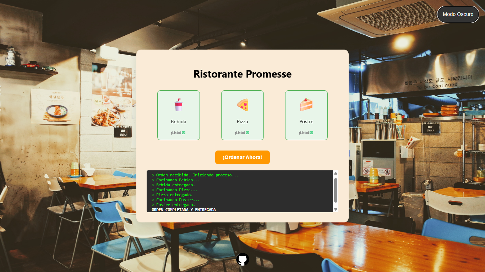

# Restaurant Order Simulation

A web-based simulation of a restaurant order fulfillment system. This project demonstrates the implementation of **JavaScript Promises** to handle sequential asynchronous tasks, ensuring that dishes are prepared and delivered in a specific order: **Drinks → Pizza → Dessert**.

## Features

*   **Sequential Logic:** Uses a strict Promise chain to ensure no dish starts cooking until the previous one has been delivered.
*   **Interactive UI:** A "Dashboard" style interface with real-time status updates for each item.
*   **Visual Feedback:** Cards change state (Active/Completed) using CSS transitions to reflect the current stage of the order.
*   **Live Console:** A built-in terminal that logs every step of the preparation process.
*   **User Control:** An interactive "Order Now" button that triggers the simulation and prevents multiple overlapping orders.

## Built With

*   **HTML5:** Semantic structure for the kitchen dashboard.
*   **CSS3:** Flexbox layout, custom animations, and state-dependent styling.
*   **JavaScript (ES6):** Promises, `setTimeout` for simulation, and DOM manipulation.

## Website Preview


## Logic Breakdown

The core of this project is a `cookDish` function that returns a **Promise**. This allows the application to "wait" for a specific amount of time (simulating cooking) before resolving and moving to the next block in the `.then()` chain.

### The Promise Chain:
```javascript
cookDish('step-bebida', 'Bebida', 1500)
    .then(() => cookDish('step-pizza', 'Pizza', 3500))
    .then(() => cookDish('step-postre', 'Postre', 2000))
    .then(() => {
        console.log("All orders delivered!");
    });